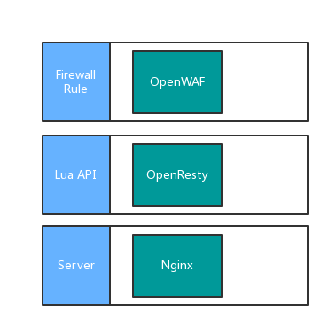
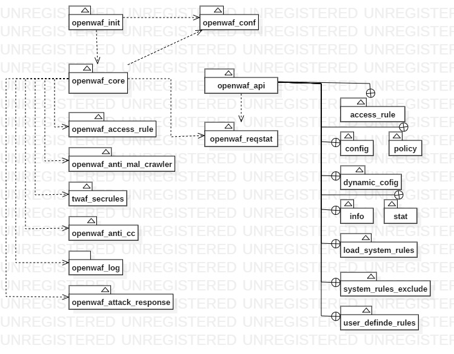

# OpenWAF项目架构

## WAF（Web Application Firewall）防火墙介绍

## 提供的功能

- Web非授权访问防护功能，跨站请求伪造（CSRF）攻击防护功能。
- 对Web攻击的防护功能（SQL注入攻击，XSS跨站攻击），对应用层DoS攻击的防护能力（HTTPFlood攻击，如CC攻击）。
- Web恶意代码防护功能（WebShell）。

## OpenWAF简介

一个开源的WAF实现，由 __行为分析引擎__ 和 __规则引擎__ 两个功能引擎构成。

- 规则引擎对单个请求进行分析；
- 行为分析引擎负责跨请求信息追踪。

规则引擎的启发来自modsecurity及freewaf(lua-resty-waf)，将ModSecurity的规则机制用lua实现。基于规则引擎可以进行协议规范，自动工具，注入攻击，跨站攻击，信息泄露，异常请求等安全防护，支持动态添加规则，及时修补漏洞。

行为分析引擎包含基于频率的模糊识别，防恶意爬虫，人机识别等防探测模块，防CSRF，防CC，防提权，文件上传防护等防攻击模块，cookie防篡改，防盗链，自定义响应头，攻击响应页面等防信息泄露模块。

除了两大引擎之外，还包含统计，日志，攻击响应页面，接入规则等基础模块。除了已有的功能模块，OpenWAF还支持动态修改配置， 动态添加第三方模块，使得在不重启引擎中断业务的条件下，升级防护。

## OpenWAF架构

OpenWAF主要基于OpenResty进行HTTP请求分析，整体架构如下：



## OpenResty简介

在详细介绍OpenWAF的各个模块之前，需要对OpenResty有一个简单的认识。OpenResty（也称为 ngx_openresty）是一个全功能的 Web 应用服务器。它打包了标准的 Nginx 核心，很多的常用的第三方模块，以及它们的大多数依赖项。
通过揉和众多设计良好的 Nginx 模块，OpenResty 有效地把 Nginx 服务器转变为一个强大的 Web 应用服务器，基于它开发人员可以使用 Lua 编程语言对 Nginx 核心以及现有的各种 Nginx C 模块进行脚本编程，构建出可以处理一万以上并发请求的极端高性能的 Web 应用。
ngx_openresty 目前有两大应用目标：
1. 通用目的的 web 应用服务器。在这个目标下，现有的 web 应用技术都可以算是和 OpenResty 或多或少有些类似，比如 Nodejs, PHP 等等。ngx_openresty 的性能（包括内存使用和 CPU 效率）算是最大的卖点之一。

2. Nginx 的脚本扩展编程，用于构建灵活的 Web 应用网关和 Web 应用防火墙。有些类似的是 NetScaler。其优势在于 Lua 编程带来的巨大灵活性。

在OpenWAF项目中，主要利用了OpenResty的LuaNginxModule对Nginx接受到的HTTP连接在不同的阶段进行自定义的处理。LuaNginxModule包含一系列的指令（Directive），这些指令的处理流程如下：


 Nginx 把一个请求分成了很多阶段，这样第三方模块就可以根据自己行为，挂载到不同阶段进行处理达到目的。OpenResty 也应用了同样的特性。所不同的是，OpenResty 挂载的是我们编写的 Lua 代码。

 这样我们就可以根据我们的需要，在不同的阶段直接完成大部分典型处理了。

- set_by_lua*: 流程分支处理判断变量初始化
- rewrite_by_lua*: 转发、重定向、缓存等功能(例如特定请求代理到外网)
- access_by_lua*: IP 准入、接口权限等情况集中处理(例如配合 iptable 完成简单防火墙)
- content_by_lua*: 内容生成
- header_filter_by_lua*: 响应头部过滤处理(例如添加头部信息)
- body_filter_by_lua*: 响应体过滤处理(例如完成应答内容统一成大写)
- log_by_lua*: 会话完成后本地异步完成日志记录(日志可以记录在本地，还可以同步到其他机器)

## OpenWAF 模块概述

OpenWAF的基础模块如下：

- 静态配置管理器 openwaf_conf：主要负责加载缺省配置文件，加载接入规则文件，加载策略配置文件，加载规则库，以及GeoIP库
- 日志 openwaf_log
- 统计 openwaf_reqstat：对访问信息、安全信息、转发信息等进行统计
- 核心层 openwaf_core：类似调度器，根据配置调用各个模块对请求进行分析，处理
- 接入规则 openwaf_access_rule：通过分析请求的域名和路径等信息，将请求转发至指定的后端服务器

功能模块如下：

- 规则引擎 openwaf_rule_engine：过滤规则的解析
- 攻击响应页面 openwaf_attack_response：用于返回自定义攻击响应页面，有效防止信息泄露
- API openwaf_api：提供REST API，用于控制读取/修改内存中的部分信息
- 防恶意爬虫 openwaf_anti_mal_crawler
- 防CC openwaf_anti_cc

各模块之间的关系如下：



## 运行机制简介

首先，OpenResty内建的nginx读取配置文件,在配置文件中：
```
include            /usr/local/openresty/nginx/conf/mime.types;
include            /opt/OpenWAF/conf/twaf_main.conf;
include            /opt/OpenWAF/conf/twaf_api.conf
```
上面的配置导入了其它配置文件，其中```twaf_main.conf```中：
```
init_by_lua_file         /opt/OpenWAF/app/twaf_init.lua
```
使用twaf_init.lua进行初始化。而twaf_init.lua文件中创建一个twaf对象，该对象的类是模块```lib.twaf.twaf_core```导出的。在创建该对象的时候会传递参数twaf_config对象，该对象是twaf_config_m类的实例，由模块```lib.twaf.twaf_conf```导出。

### lib.twaf.twaf_conf

用于解析接入规则，过滤规则等配置的模块，通过```load_default_config```方法导入默认配置；```load_access_rule```导入接入规则配置。```load_policy_config```方法导入策略。```load_rules```方法会导入系统规则知识库。最后```lib.twaf.twaf_conf```模块导出的类应该具有如下属性：
```
rules               -- 根据阶段分组后的规则
rules_id            -- 所有有效的规则的ID
disable_rules_id    -- 无效规则的ID  
global_conf_uuid    -- 全局策略文件名
twaf_default_conf   -- 默认配置策略
twaf_policy         -- 所有导入的策略配置，除默认配置之外
```

在nginx中配置的每个server都导入配置文件twaf_server.conf,该文件内容如下：

```
rewrite_by_lua_file       /opt/OpenWAF/app/twaf_rewrite.lua;
access_by_lua_file        /opt/OpenWAF/app/twaf_access.lua;
header_filter_by_lua_file /opt/OpenWAF/app/twaf_header_filter.lua;
body_filter_by_lua_file   /opt/OpenWAF/app/twaf_body_filter.lua;
log_by_lua_file           /opt/OpenWAF/app/twaf_log.lua;

set $twaf_upstream_server "";
set $twaf_attack_info     "";
set $twaf_cache_flag       1;
```
前面五行通过调用lua在nginx的各个阶段进行处理，虽然这里都是不同的lua模块，但实际上都是调用twaf_core模块的run()方法进行处理。

### twaf_core.lua

```twaf_core```类似于一个dispatcher，通过```ngx.get_phase()```获取当前HTTP请求在Nginx中所处的阶段。然后在不同的阶段，调用不同的模块对HTTP的连接进行过滤，分析。

