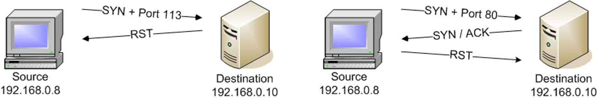
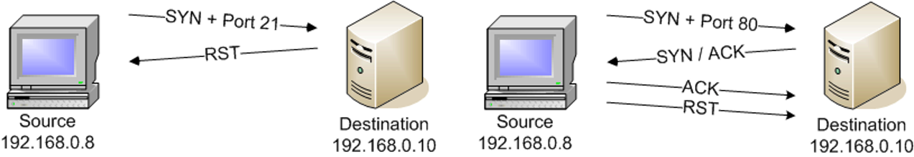
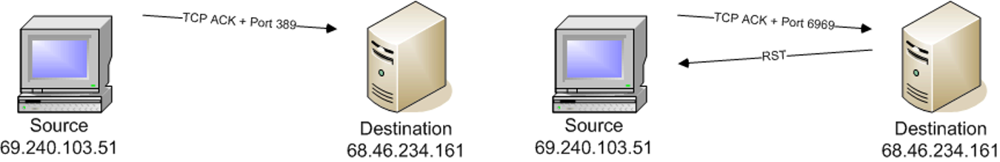
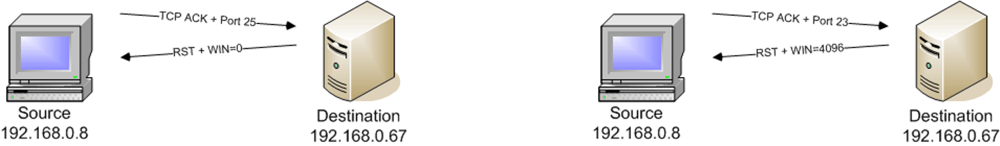

# Scanning: UDP & TCP

## Port

唯一确定一台主机上的进程

周知端口号(0~1023)：7 for Echo, 13 for daytime, 53 for DNS name server, 80 for http, 443 for https, 21 for FTP.

注册端口号(1024~49151)：程序开发者可以到ICANN去为自己开发的程序申请一个端口号。

动态端口号(49152~65536)：临时使用或者作为私有端口号。

## UDP

best-effort semantics(尽力而为)

基于UDP的应用:DNS, Stream video, VoIP

## nmap

nmap -iL list.txt read from a list.

nmap -iR [number of targets] 随机选取n个hosts进行扫描。

nmap [targets] --exclude [target(s)] 排除指定主机。

nmap [targets] --excludefile [list.txt] 根据文件排除指定主机。

|nmap scan|command syntax|requires privileged access|identifies TCP ports|identifes UDP port|
|:----|:----|:----|:----|:----|
|TCP SYN Scan|-sS|YES|YES|NO|
|TCP connect() Scan|-sT|NO|YES|NO|
|FIN Scan|-sF|YES|YES|NO|
|Xmas Tree Scan|-sX|YES|YES|NO|
|NULL Scan|-sN|YES|YES|NO|
|Ping Scan|-sP|NO|NO|NO|
|Version Detection|-sV|NO|NO|NO|
|UDP Scan|-sU|YES|NO|YES|
|IP Protocal Scan|-sO|YES|NO|NO|
|ACK Scan|-sA|YES|YES|NO|
|Window Scan|-sW|YES|YES|NO|
|RPC Scan|-sR|NO|NO|NO|
|List Scan|-sL|NO|NO|NO|
|Idle Scan|-sI|YES|YES|NO|
|FTP Bounce Attack|-b|NO|YES|NO|

### TCP SYN Scan (-sS)

Half open scanning

1. When an open port is identified, TCP handshake is reset.
1. If a scan type is not specified, and has privileged access,the TCP SYN scan is used by default.

如下图所示，左为端口关闭的情况，右边为端口打开的情况。


_**Advantages**_
-sS never actually creates a TCP session, so it’s not logged by the destination
_**Disadvantage**_
Requires nmap have privileged access to the system
_**When to use the TCP SYN Scan**_

1. -sS works on all systems
1. It is a clean scan type
1. It provides open, closed, filterd port information

### TCP connect() Scan (-sT)

直接调用socket的connect()函数建立TCP连接。
如图，左边为端口关闭的情况，右边为端口打开的情况。


***Advantage***
No special privileges are required
***Disadvantage***
The scan will be logged by the target system
***When to use***
It is the last resort

通过wireshark抓包可以看到，对于打开的端口，使用-sS扫描时，发送SYN包，接受到SYN/ACK之后会向目标发送RST。而使用-sT则会完成三次握手，建立连接。

### TCP ACK Scan (-sA)

ACK scan won’t locate an open port. It only provides “filtered” or “unfiltered” disposition.
对于主机来说，收到一个不请自来的ACK，会向源主机发送RST，除非端口被过滤。
如图，左边为端口被过滤，右边为端口没被过滤。


***Advantages***
It doesn’t open any application sessions, the conversation is simple
***Disadvantage***
Can’t confirm an open port
***When to use***
To identify whether the traffic can go through a firewall

### Stealth Scanning

***The FIN Scan (-sF), Xmas Tree Scan (-sX), and Null Scan (-sN)***

1. They send a single frame to a TCP port and expect a single response
1. They operate by manipulating the bits of TCP header—nmap combine bit options that should never occur in real world (Fin excluded) and watch the target’s response
1. **RFC 793:** a closed TCP port should send a RST frame and an available port should not respond at all
1. Nmap categorizes the responses as either closed, or open|filtered
1. **Windows** will reply with a RST frame for all queries
1. Nmap builds these frames using raw socket

***联合使用ACK扫描和FIN扫描可以帮助判断被过滤端口的开放状态***
使用该方法的前提大概是：
在所有的SYN包被拒，然后nmap –sS不能使用的情况
FIN可以判断出关闭端口以及 Open/filtered端口；
而ACK扫描可以判断出有无被filter
这样如果一个开放并且没有被过滤的端口，可以被判断出来。

### Ping Scan -sP

- Common ICMP Echo
- Requires no privileged access
- It is very fast, to decide whether the ICMP protocol is filtered or not
- Ping scan won’t cooperate with other scans
- ICMP is always filtered (suggested)

### Version Detection (-sV)

version detection scan runs in conjunction with another scan type that will identify open ports, by default, it will be TCP SYN.
With an open port, version detection will begin probe to get as much information as possible.

扫描示例：

```shell
➜  ~ sudo nmap -sV 192.168.110.130

Starting Nmap 5.21 ( http://nmap.org ) at 2017-11-16 06:55 PST
Nmap scan report for bogon (192.168.110.130)
Host is up (0.0014s latency).
Not shown: 999 closed ports
PORT   STATE SERVICE VERSION
21/tcp open  ftp     vsftpd 2.3.5
MAC Address: 00:0C:29:B5:F4:19 (VMware)
Service Info: OS: Unix

Service detection performed. Please report any incorrect results at http://nmap.org/submit/ .
Nmap done: 1 IP address (1 host up) scanned in 0.58 seconds
```

### OS Scan

```shell
OS DETECTION:
             -O: Enable OS detection
             --osscan-limit: Limit OS detection to promising targets
             --osscan-guess: Guess OS more aggressively
TIMING AND PERFORMANCE:
             Options which take <time> are in milliseconds, unless you append ´s´
             (seconds), ´m´ (minutes), or ´h´ (hours) to the value (e.g. 30m).
             -T<0-5>: Set timing template (higher is faster)
MISC:
             -6: Enable IPv6 scanning
             -A: Enables OS detection and Version detection, Script scanning and Traceroute
```

-A 选项提供OS扫描

扫描示例：

```Shell
➜  ~ sudo nmap -A -T5 192.168.110.130

Starting Nmap 5.21 ( http://nmap.org ) at 2017-11-16 07:03 PST
Nmap scan report for bogon (192.168.110.130)
Host is up (0.00049s latency).
Not shown: 999 closed ports
PORT   STATE SERVICE VERSION
21/tcp open  ftp     vsftpd 2.3.5
|_ftp-anon: Anonymous FTP login allowed
MAC Address: 00:0C:29:B5:F4:19 (VMware)
Device type: general purpose|specialized|webcam|WAP|firewall
Running (JUST GUESSING) : Linux 2.6.X|2.4.X (91%), Crestron 2-Series (91%), AXIS Linux 2.6.X (89%), Check Point embedded (87%), Check Point Linux 2.4.X (87%), Gemtek embedded (87%)
Aggressive OS guesses: Linux 2.6.22 (91%), Crestron XPanel control system (91%), Linux 2.6.17 - 2.6.31 (91%), Linux 2.6.24 (90%), Linux 2.6.13 - 2.6.28 (89%), Linux 2.6.22 - 2.6.23 (89%), AXIS 211A Network Camera (Linux 2.6) (89%), AXIS 211A Network Camera (Linux 2.6.20) (89%), Linux 2.4.20 (Red Hat 7.2) (89%), Linux 2.6.24 - 2.6.28 (89%)
No exact OS matches for host (test conditions non-ideal).
Network Distance: 1 hop
Service Info: OS: Unix

HOP RTT     ADDRESS
1   0.49 ms bogon (192.168.110.130)

OS and Service detection performed. Please report any incorrect results at http://nmap.org/submit/ .
Nmap done: 1 IP address (1 host up) scanned in 3.70 seconds
```

### UDP Scan (-sU)

UDP是无连接的协议，扫描比较简单：

- 收到ICMP Port Unreachable: 端口关闭
- 没有收到消息： open|filtered port
- 收到数据： 端口打开

### Window Scan (-sW)

与ACK扫描类似，但是该扫描可以鉴别打开的端口。

如图，左边为端口关闭，右边为端口打开



-sW doesn’t work on all devices, and the susceptible systems are dwindling. It can also help in identifying OS types.

### List Scan (-sL)

- list scan isn't really a scan, but it does provide some troubleshooting and testing capabilities.
- The list scan simply lists the IP addresses that would normally be actively scanned.
- It performs a reverse DNS lookup on every IP address in the scan.
- The list scan is often used as a sanity check when a complex scan is defined.
- nmap will automatically use the default DNS server to convert the IP addresses to names. This makes it easy to find interesting device names!

### IDLE Scan

#### 理论基础

- 对于一个SYN包，如果目标主机端口打开，则目标主机回复一个SYN/ACK。如果端口关闭，回复一个RST。
- 主机收到一个不请自来的SYN|ACK，主机必须回复一个RST。主机会忽略不请自来的RST。
- 每一个IP报文都有"fragment identification"域，很多操作系统每发送一个报文只是简单的递增其数值。这样，攻击者可以知道距离上一次发包，目前发送了多少个包。

#### SYN-cookie

它的原理是，在TCP服务器接收到TCP SYN包并返回TCP SYN + ACK包时，不分配一个专门的数据区，而是根据这个SYN包计算出一个cookie值。这个cookie作为将要返回的SYN ACK包的初始序列号。当客户端返回一个ACK包时，根据包头信息计算cookie，与返回的确认序列号(初始序列号 + 1)进行对比，如果相同，则是一个正常连接，然后，分配资源，建立连接。
